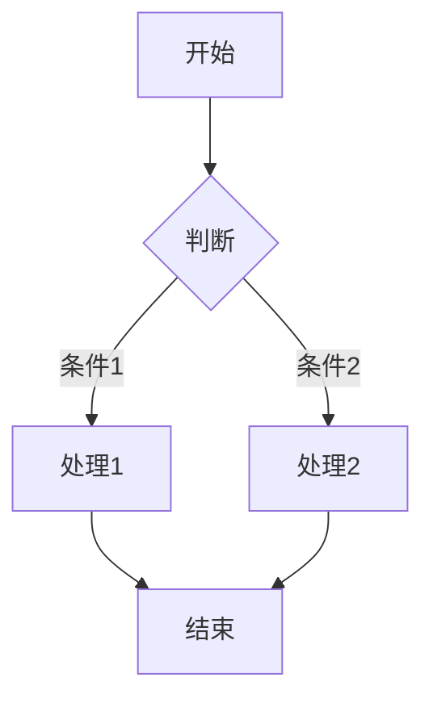

# Jakho Garden

个人博客，基于 [Next.js](https://nextjs.org) 开发。

因 xlog.app 运行和发文不稳定，遂迁移为自建博客，该博客程序基于 [elecmonkey-garden
](https://github.com/elecmonkey/elecmonkey-garden) 针对个人使用习惯进行改造，适配原 xlog.app 的文章地址路径。

## 从 xlog.app 迁移（非必须）

登录 [xlog.app
](https://xlog.app/)，进入「仪表盘」-> 「设置」 -> 「导出数据」，导出博客数据后的压缩包解压缩。把项目文件夹中的 `convert-notes-to-md.js` 文件放入解压后的目录内，修改 `convert-notes-to-md.js` 内的 `author` 字段 ，运行 `node convert-notes-to-md.js`，转换成功后，Markdown 文件存放在 `markdown` 目录内。

## 技术栈

- **框架**: Next.js
- **前端**: React
- **样式**: TailwindCSS
- **内容管理**: MDX + Markdown
- **代码处理**: React Syntax Highlighter（基于 PrismJS）
- **图表渲染**: Mermaid（客户端渲染）
- **标签云熏染**: [React-TagCloud](https://github.com/elecmonkey/jakho-garden)

### 内容渲染

- **Markdown 渲染**: 使用 react-markdown 进行 Markdown 渲染
- **代码语法高亮**: 支持多种编程语言的自动语法高亮
- **图表支持**: 通过 Mermaid 集成支持流程图、时序图、类图等多种图表
- **响应式图片**: 自动优化图片显示效果
- **暗色模式**: 支持明暗主题切换，代码块和图表自动适应主题

### 文件组织

- **元数据支持**: 所有内容支持丰富的元数据（标题、日期、标签、封面等）

## 本地开发

1. 克隆项目并安装依赖:

```bash
git clone <仓库地址>
cd <项目文件夹>
pnpm install
```

2. 启动开发服务器:

```bash
pnpm dev
```

访问 [http://localhost:3000](http://localhost:3000) 预览。

## 项目编译

要为生产环境编译项目，运行以下命令：

```bash
pnpm build
```

编译完成后，可以运行生产环境服务器：

```bash
pnpm start
```

## Vercel 部署

1. **Fork** 本仓库到你自己的 GitHub 账户

2. 修改你的博客内容：

- 在 `/content/posts/` 目录中添加或修改 Markdown 文件
- 修改 `config.ts` 或 `.env` 配置（可选）

3. 一键部署到 Vercel（需先 Fork 到自己的仓库）：
   部署到[](https://vercel.com/new/clone?repository=https://github.com/<your-github-username>/<repo-name>)
   > ⚙️ 请在上方链接中将 `<your-github-username>` 替换为你自己的 GitHub 用户名。

## 服务端自部署（PM2）

1. 确保服务器上已安装 Node.js (推荐 v20+), pnpm 和 pm2

2. 克隆代码并安装依赖:

```bash
git clone <仓库地址> /path/to/your/app
cd /path/to/your/app
pnpm install
```

3. 构建应用:

```bash
pnpm build
```

4. 使用 PM2 启动服务:

```bash
pm2 start node_modules/.bin/next --name "jakho-garden" -- start -p 3000
```

5. 设置开机自启:

```bash
pm2 startup
pm2 save
```

6. 查看运行状态:

```bash
pm2 status
pm2 logs jakho-garden
```

7. 更新部署:

```bash
cd /path/to/your/app
git pull
pnpm install
pnpm build
pm2 reload "jakho-garden" || pm2 start node_modules/.bin/next --name "jakho-garden" -- start -p 3000
```

### PM2 启动命令

```bash
# 首次启动
pm2 start node_modules/.bin/next --name "jakho-garden" -- start -p 3000

# 重新加载已有应用
pm2 reload "jakho-garden"

# 或组合命令（先尝试重载，若失败则启动）
pm2 reload "jakho-garden" || pm2 start node_modules/.bin/next --name "jakho-garden" -- start -p 3000
```

## 环境变量配置

使用环境变量进行配置。创建 `.env.local` 文件并设置以下变量：

| 变量名                          | 说明                    | 示例值                         |
| ------------------------------- | ----------------------- | ------------------------------ |
| `NEXT_PUBLIC_SITE_URL`          | 网站地址                | `https://yourdomain.com`       |
| `NEXT_PUBLIC_SITE_NAME`         | 网站名称                | `My Blog`                      |
| `NEXT_PUBLIC_SITE_DESC`         | 网站描述                | `Blog Description`             |
| `NEXT_PUBLIC_SITE_AVATAR_URL`   | 网站头像地址（可选）    | _(留空)_                       |
| `NEXT_PUBLIC_SOCIAL_GITHUB_URL` | GitHub 主页地址（可选） | `https://github.com/your-name` |

对于生产环境，可以在 PM2 的配置文件中设置环境变量。

## 内容管理

博客文章存储在 `src/content/posts` 目录中，使用 Markdown 格式。每篇文章需要包含以下前置元数据：

```md
---
title: "文章标题"
date: "YYYY-MM-DD"
description: "文章简短描述"
cover: "文章封面图地址（非必须）"
tags: ["标签1", "标签2"]
---

文章内容...
```

### Mermaid 图表使用方法

在 Markdown 中使用 Mermaid 图表，只需要创建一个 `mermaid` 代码块：

````markdown

````

支持的图表类型包括：流程图、时序图、类图、甘特图等。

## 自定义与扩展

### 主题定制

创建 `tailwind.config.js` 文件来自定义主题颜色、字体等。

### 添加新页面

在 `src/app` 目录下创建新目录和 `page.tsx` 文件，遵循 Next.js App Router 的约定。

## 许可协议

### 代码部分

源代码采用 [MIT 许可证](LICENSE)。

### 内容部分

所有博客文章、图片和其他创意内容采用 [知识共享署名-非商业性使用-相同方式共享 4.0 国际许可协议（CC BY-NC-SA 4.0）](https://creativecommons.org/licenses/by-nc-sa/4.0/deed.zh)。
